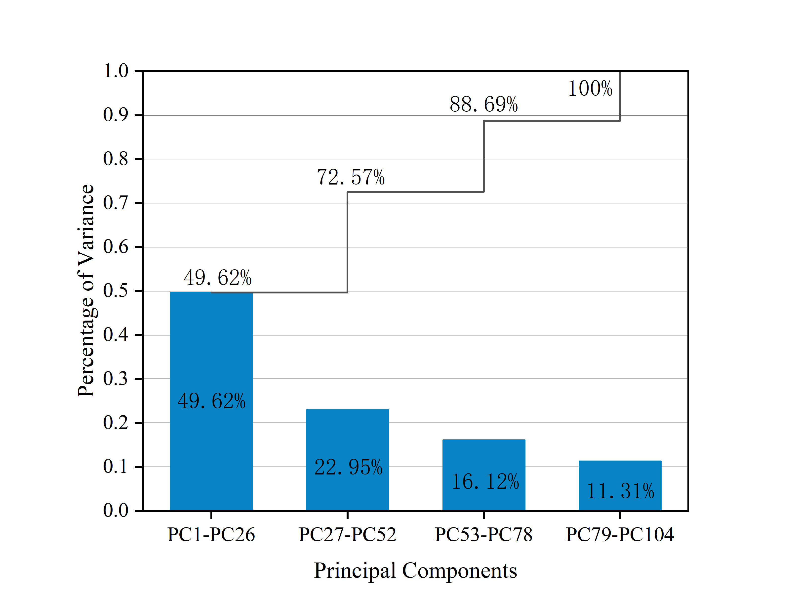

### Empirical Studies on Failure Prediction for Distributed Systems Based on Tree models and Feature Selection

#### Explanation：

In our project,  We conduct an empirical study using six feature selection methods against four tree-based models. We present the source code and relevant results of the empirical study.

#### Related Environment：

* python 3.6.13
* scikit-learn 0.24.2
* skfeature-chappers 0.11.2
* matplotlib 3.3.4

#### Dataset
The dataset we used can be found on  https://www.cnsoftbei.com/plus/view.php?aid=824. If the page expires, we will subsequently publish the experimental data with consent. The dataset contains redundant KPI metrics. We conduct PCA analysis on the dataset, and the results are as follows:

#### Fature Selection methods
* Chi-Square
* Mutal Information
* Gini Index
* Info Gain
* Fisher Score
* ReliefF

#### The tree-based models we used to construct failure prediction model
* Decision Tree
* Random Forest
* XGBoost
* LightGBM
